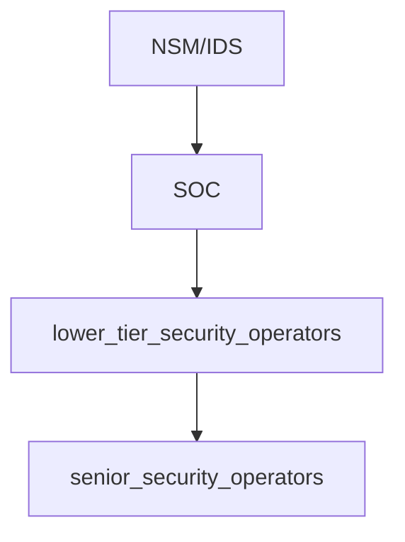

# DEEPCASE Semi-Supervised Contextual Analysis of Security Events - Notes
###### tags: `Meeting Paper` `NTU`
:::info
Van Ede, T., Aghakhani, H., Spahn, N., Bortolameotti, R., Cova, M., Continella, A., ... & Vigna, G. (2022, May). Deepcase: Semi-supervised contextual analysis of security events. In 2022 IEEE Symposium on Security and Privacy (SP) (pp. 522-539). IEEE.
:::
## Background
[What is NSM(Network Security Monitors)?](https://ithelp.ithome.com.tw/articles/10202297)
> NSM主要目的是偵測、找出入侵者，提高能見度。它建立在「我們一定會被攻擊，而且最終防禦一定會被突破」的思惟上。假設意志堅決的駭客最終打穿我們辛苦建立的防禦，但只要能在入侵者進一步破壞、感染系統前偵測、做出回應，讓入侵者無法達到目的，便能阻擋這波攻擊

> NSM不是等接收IDS/IPS等等資安設備觸發警示後才開始收集，而是平時便預先主動收集資料，提供NSM平台審視、分析，強化可見度，主動找出入侵軌跡
---
[What is IDS(Intrusion Detection Systems)?](https://www.ithome.com.tw/tech/28712)
> 入侵偵測系統（Intrusion Detection System，IDS）是用來偵測資訊系統或網路上潛在的惡意破壞活動

* 網路型入侵偵測系統(NIDS):主要是由一個或多個偵測器，加上收集與分析資料的主控臺所組成，可以分析每個通過的網路封包，並與已知的攻擊特徵進行比對，如果符合某項攻擊特徵，系統就會啟動防護機制，例如發簡訊或命令防火牆中斷該連線。
* 主機型入侵偵測系統(HIDS):是從主機系統稽核日誌檔演進而來，必須在主機上安裝代理程式﹙Agent﹚，負責監視主機內部的程序，並監控記錄檔與可疑活動，若有任何系統事件都會被記錄至日誌檔，並與攻擊特徵資料庫比對，判斷主機是否遭到攻擊
* 誘捕型入侵偵測系統(Deception Systems):目的是偵測未經授權的活動，任何進出誘捕系統的封包都會被認定是可疑的。但它卻是受到爭議的產品，有些廠商認為誘捕型系統只適合學術研究，因為它誘導駭客上勾，因此收集的證據無法用來起訴駭客
---
Basic security event checking workflow

---

[什麼是 SSL/TLS 憑證？](https://aws.amazon.com/tw/what-is/ssl-certificate/)
> SSL/TLS 憑證是一種數位物件，允許系統驗證身分並隨後使用 Secure Sockets Layer/Transport Layer Security (SSL/TLS) 協定，與另一個系統建立加密網路連線。憑證是在稱為公開金鑰基礎設施 (PKI) 的加密系統內使用。如果雙方都信任第三方 (稱為憑證授權單位)，PKI 會使用憑證讓其中一方建立另一方的身分。因此，SSL/TLS 憑證可作為數位身份證，用於保護網路通訊安全，以及為網際網路上的網站和私有網路上的資源建立身分。

---

[What is SIEM(Security Information and Event Management)](https://ithelp.ithome.com.tw/articles/10195623)
> SIEM的功能和一般日誌管理工具類似，都會將來自不同伺服器和設備的日誌和事件紀錄集中在一個地方 (通常是Log server伺服器本身硬碟或特定的儲存池Storage pool)，避免日誌和紀錄隨著機器故障遺失，符合稽核要求，可以進行關鍵字或日期查詢，所以也有人直接用日誌管理工具來進行分析
功能
* 彙整、解讀多項系統設備日誌
* 資料圖形化
* SIEM具備強大的比對Correlation 功能
e.g.帳號登入失敗、創建新帳號、帳號權限提升等等可能是攻擊行為也可能是網管的正常登入，要看一連串的流量或封包資料才能判斷$\to$耗費人力
* 整合其他資安工具或資安服務

---

[What is URI](https://ithelp.ithome.com.tw/articles/10266610)
> URI 可以：
> 1. 單獨表示 URL
> 2. 單獨表示 URN
> 3. 兩者兼具
e.g. `https://www.example.com.tw/index.html
    urn:isbn:9780132350884`

---

Model Background
[NTU ADL - Attention Mechanism 注意力機制](https://youtu.be/YJYcMLq1_f4)
[NTU ML - 自注意力機制 (Self-attention) (上)](https://youtu.be/hYdO9CscNes)
[NTU ML - 自注意力機制 (Self-attention) (下)](https://youtu.be/gmsMY5kc-zw)
[NTU ML - 自編碼器 (Auto-encoder) (上) – 基本概念](https://youtu.be/3oHlf8-J3Nc)
[NTU ML - 自編碼器 (Auto-encoder) (下)](https://youtu.be/JZvEzb5PV3U)
[GRU VS LSTM](https://tengyuanchang.medium.com/比較長短期記憶模型-lstm-與改良後的遞歸神經網路模型-gru-813dec22ec6d)

---

Model Trick
[Label Smooth](https://medium.com/aiot-taipei/training-trick-label-smoothing-93833db95ef8)
[KL Divergence](https://roger010620.medium.com/關於深度學習中的loss-function-entropy-cross-entropy-kl-divergence-and-f-divergence-3e997f293b2)
[DBSCAN](https://pyecontech.com/2020/07/15/dbscan/)

---

Experience Metrics
[Precision, Recall, F1-score, Accuracy](https://ycc.idv.tw/confusion-matrix.html)
[Homogeneity Score](https://blog.csdn.net/u010159842/article/details/78624135)

---

About Attack
[Bladabindi](https://blog.trendmicro.com.tw/?p=58182)